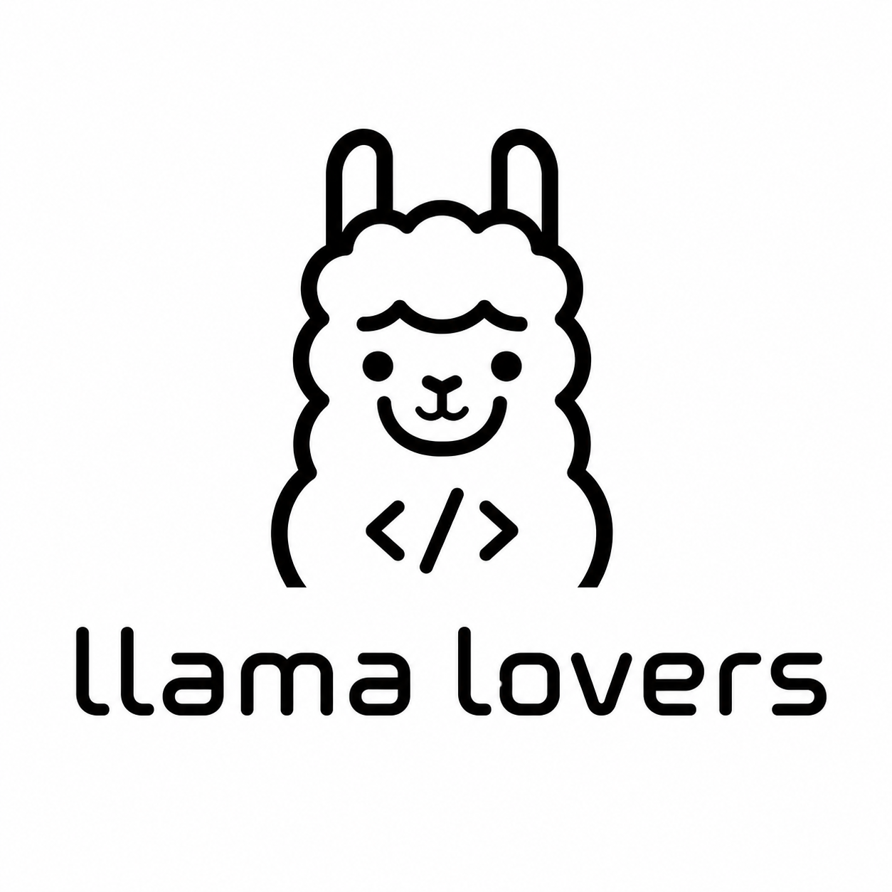

# Llama Lovers

**Open-source projects in AI, accessibility and software engineering.**

Explore our projects, meet the team and watch our hackathon demonstrations.

[Explore our projects](projects/index.md){ .md-button .md-button--primary }
[Meet the team](team.md){ .md-button }

## What we build

-   **FastFence — AI control layer**

    ---

    Policies between AI agents, models and tools. Review changes, test their impact and inspect security decisions.

    [Explore FastFence →](projects/fastfence.md)

-   **FastEcho — accessible browsing**

    ---

    A Chrome extension that helps blind and low-vision users interact with websites through voice commands.

    [Explore FastEcho →](projects/fastecho.md)

-   **Urban Kompas — public services**

    ---

    An assistant that helps residents navigate municipal services, with answers grounded in BIP sources and documents.

    [Explore Urban Kompas →](projects/urban-kompas.md)

-   **Breathalyzer — computer vision**

    ---

    Shelf product detection for Hackology II. Five prediction sources, four model weights and a reported public mAP@0.5 of 0.7420.

    [Explore the project →](projects/breathalyzer.md)

## Hackathon projects

Our HackYeah 2026 projects explore two different challenges: controlling AI interactions with **FastFence** and making the web easier to navigate with **FastEcho**.

[Hackathon projects](hackathons.md){ .md-button }
[Presentations and demos](presentations.md){ .md-button }

## Follow the code

Source code, setup instructions and project documentation are available on GitHub.

[llama-lovers on GitHub ↗](https://github.com/llama-lovers){ .md-button .md-button--primary }
