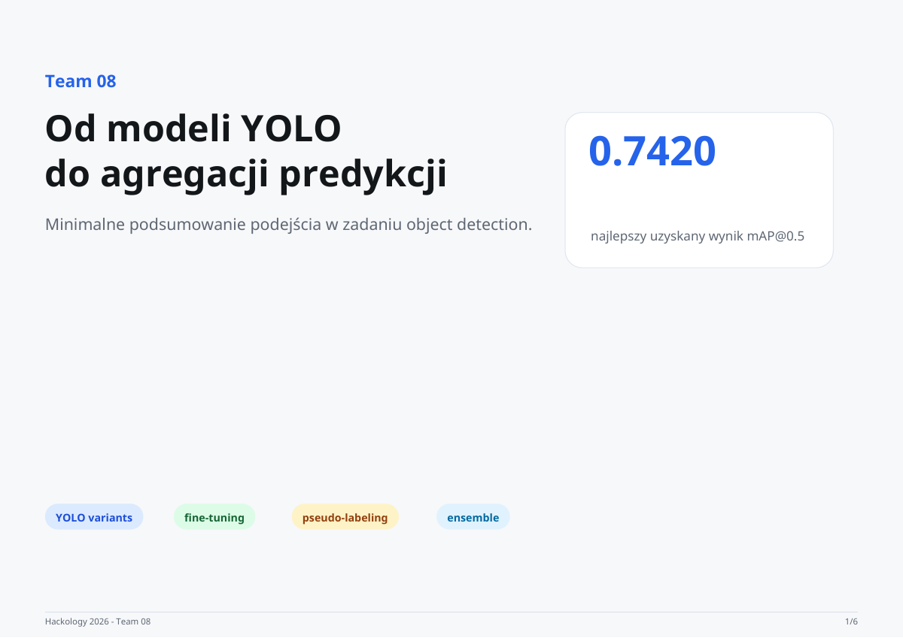

# Shelf product detection

**Hackology II · Team 08 · repository: Breathalyzer**

Detect and classify products in photographs of crowded store shelves. The challenge includes visually similar product variants, small objects and an imbalanced set of 369 categories.

[GitHub ↗](https://github.com/llama-lovers/breathalyzer){ .md-button .md-button--primary }
[Open presentation](../assets/presentations/hackology.pdf){ .md-button }

## Final approach

The team experimented with individual YOLO models, inference resolutions, fine-tuning and pseudo-labeling. The final solution combines **five prediction sources from four unique model weights**, using test-time augmentation and Weighted Box Fusion.

Two sources use the same weights at different resolutions. Stronger prediction sources receive a larger weight in the ensemble.

## Reported results

| Metric | Result | Scope |
| --- | --- | --- |
| Public mAP@0.5 | **0.7420** | Public evaluation reported in the presentation |
| Validation mAP@0.5 | **0.8528** | Local holdout reported in the detailed slides and repository |
| Prediction sources | **5** | Four unique weights, with one evaluated at two resolutions |

Public and validation results come from different datasets and should be read separately.

## What the experiments showed

More sources did not automatically improve the public result. An eight-source ensemble improved validation performance but performed worse on the public set. The selected five-source setup balanced complementary models and false positives.

Dense shelves and visually similar variants remained difficult. The detailed slides identify tiled inference, confidence calibration and a two-stage detection/classification approach as possible follow-up work.

Source: [Team 08 presentation](../assets/presentations/hackology.pdf), [detailed slide notes](https://github.com/llama-lovers/presentations/blob/main/2026_Hackology/slides.md) and [project repository](https://github.com/llama-lovers/breathalyzer).
