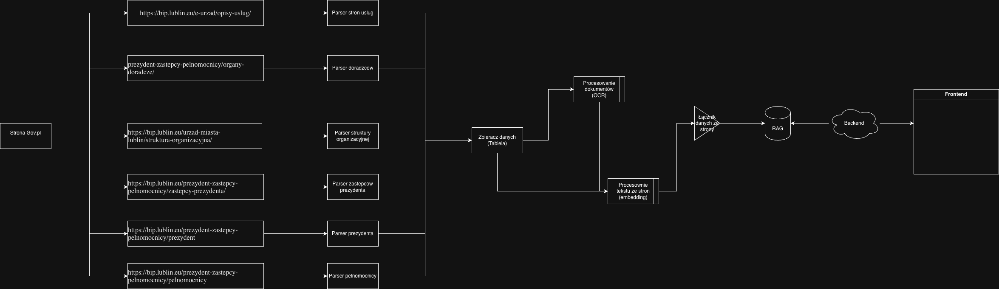

# Urban Kompas

Urban Kompas is an AI assistant for municipal services in Lublin.

It retrieves the relevant procedure and explains the required steps, documents and responsible office, with links to municipal sources.

[GitHub](https://github.com/llama-lovers/urban-kompas)
[Download presentation](../assets/presentations/urban-kompas.pptx)

## The hackathon prototype

The final presentation describes a chat interface backed by a municipal knowledge base. The workflow collects content from Lublin's BIP public-information pages and documents, extracts text with OCR, indexes it and retrieves context before generating an answer.

- Explain a procedure in plain language.
- List the required attachments and where the resident should go.
- Cite the underlying BIP page or document.
- Mark uncertainty when evidence is incomplete.
- Avoid a definite answer when no reliable source was found.

## Architecture

The deck describes **Next.js / React**, **FastAPI with SSE**, **Qdrant**, **MiniLM embeddings**, a **Polish RoBERTa reranker**, **OCR / vision models** and a **local Qwen model**, packaged with Docker Compose.

## Demonstration scenario

A resident asks about the documents needed for a one-off childbirth allowance. The assistant retrieves relevant sources, explains the steps and attachments, identifies the responsible office and links back to the source.

The prototype helps a resident prepare for contact with the office. It does not replace an official decision.

## Next steps from the presentation

Expand the supported procedures, refresh BIP content automatically, version source documents, evaluate retrieval and answers, and run a pilot with resident feedback.

Source: the team's [final Urban Kompas presentation](../assets/presentations/urban-kompas.pptx), in the [presentation repository](https://github.com/llama-lovers/presentations/tree/main/2026_urbanlab-challenge).
